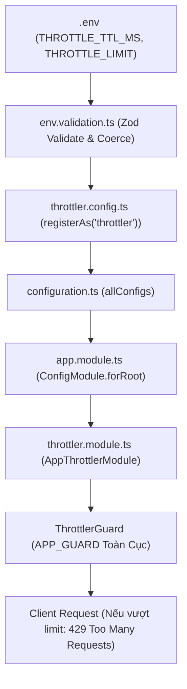

# Hướng dẫn chi tiết về Throttler (Rate Limiting) và `registerAs` trong NestJS

Tài liệu này giải thích chi tiết cấu trúc, cách thức hoạt động và phương pháp triển khai hệ thống **Rate Limiting** trong thư mục [`src/config/throttler`](./) cùng cơ chế cấu hình phân vùng (**Namespaced Configuration**) với `registerAs`.

---

## 1. Tổng quan về Rate Limiting (Throttler)

### 1.1. Rate Limiting là gì?
Rate Limiting (giới hạn tần suất request) là kỹ thuật kiểm soát số lượng request mà một client (thường phân biệt qua địa chỉ IP) có thể gửi đến máy chủ trong một khoảng thời gian nhất định.

### 1.2. Mục đích
- **Chống tấn công Brute-force:** Hạn chế số lần đoán mật khẩu, mã OTP, token đăng nhập.
- **Chống DoS / DDoS ứng dụng:** Ngăn chặn việc gửi dồn dập hàng nghìn request làm cạn kiệt tài nguyên (CPU, RAM, kết nối Database).
- **Ngăn chặn lạm dụng tài nguyên:** Tránh việc bot tự động cào dữ liệu (scraping) liên tục gây quá tải server.

---

## 2. Cấu trúc thư mục và vai trò các file

```
src/config/throttler/
├── throttler.config.ts   # Định nghĩa cấu hình namespace & mapping từ .env
└── throttler.module.ts   # Khởi tạo bất đồng bộ ThrottlerModule theo kiến trúc module
```

### 2.1. Sơ đồ luồng hoạt động trong hệ thống



---

## 3. Chi tiết mã nguồn `src/config/throttler`

### 3.1. `throttler.config.ts`
```typescript
import { registerAs } from '@nestjs/config';

export const THROTTLER_CONFIG = 'throttler';

export default registerAs(THROTTLER_CONFIG, () => ({
  ttl: parseInt(process.env.THROTTLE_TTL_MS ?? '1000', 10),
  limit: parseInt(process.env.THROTTLE_LIMIT ?? '60', 10),
}));
```

- **`THROTTLER_CONFIG`**: Hằng số định danh namespace, tránh việc gõ chuỗi thô (`hardcoded string`) ở nhiều nơi.
- **`ttl` (Time to live)**: Thời gian theo dõi tính bằng mili-giây (mặc định: `1000ms = 1 giây`).
- **`limit`**: Số lượng request tối đa được phép gửi trong khoảng `ttl` đó (mặc định: `60 requests`).
- **Ý nghĩa cấu hình:** Client chỉ được phép gửi tối đa 60 request trong 1 giây. Nếu vượt quá, server lập tức từ chối và trả về HTTP `429`.

---

### 3.2. `throttler.module.ts`
```typescript
import { Module } from '@nestjs/common';
import { ConfigService } from '@nestjs/config';
import { ThrottlerModule } from '@nestjs/throttler';
import { THROTTLER_CONFIG } from './throttler.config';

@Module({
  imports: [
    ThrottlerModule.forRootAsync({
      inject: [ConfigService],
      useFactory: (config: ConfigService) => {
        const cfg = config.getOrThrow<{ ttl: number; limit: number }>(
          THROTTLER_CONFIG,
        );

        return {
          throttlers: [
            {
              name: 'default',
              ttl: cfg.ttl,
              limit: cfg.limit,
            },
          ],
        };
      },
    }),
  ],
  exports: [ThrottlerModule],
})
export class AppThrottlerModule {}
```

- **Tính module hóa (`AppThrottlerModule`):** Tách biệt cấu hình rate limit ra khỏi `app.module.ts` giúp code dễ quản lý, dễ bảo trì và dễ viết test.
- **Cấu hình bất đồng bộ (`forRootAsync`):** Dùng `useFactory` kết hợp `inject: [ConfigService]` để lấy động giá trị từ môi trường khi ứng dụng khởi động.
- **`config.getOrThrow`**: Bắt buộc phải có namespace `throttler`, nếu thiếu sẽ dừng khởi động ứng dụng và báo lỗi ngay lập tức thay vì chạy âm thầm với giá trị `undefined`.
- **Cấu hình `throttlers` (phiên bản `@nestjs/throttler` v5+)**: Hỗ trợ nhiều bộ đếm (named throttlers). Dự án đang cấu hình một bộ đếm mặc định tên là `default`.

---

## 4. Chuyên sâu về `registerAs` trong NestJS

### 4.1. `registerAs` là gì?
`registerAs` là hàm tiện ích thuộc `@nestjs/config` dùng để đăng ký **Cấu hình phân vùng (Namespaced Configuration)**.

Nó cho phép nhóm các thiết lập liên quan đến một chức năng (như Database, Mail, Auth, Throttler) vào một đối tượng riêng biệt dưới một khóa đại diện (Namespace Key).

### 4.2. So sánh giữa dùng trực tiếp `process.env` và `registerAs`

| Tiêu chí | Đọc trực tiếp `process.env` | Dùng `registerAs` |
| :--- | :--- | :--- |
| **Kiểu dữ liệu** | Luôn là `string \| undefined`, phải parse nhiều lần | Được ép kiểu ngay khi khởi tạo (`number`, `boolean`, `array`,...) |
| **Tổ chức code** | Phẳng, dễ trùng tên biến (`PORT`, `HOST`) | Phân cấp rõ ràng (`throttler.ttl`, `database.host`, `app.port`) |
| **Type Safety** | Không có hỗ trợ autocomplete | Hỗ trợ 100% Autocomplete qua `ConfigType` |
| **Kiểm thử (Unit Test)** | Phải sửa biến môi trường toàn cục `process.env` | Chỉ cần mock object cấu hình đơn giản |

### 4.3. Cách sử dụng `registerAs` chuẩn mực qua 3 bước

#### Bước 1: Khai báo file cấu hình
```typescript
import { registerAs } from '@nestjs/config';

export const APP_CONFIG = 'app';

export default registerAs(APP_CONFIG, () => ({
  port: parseInt(process.env.PORT ?? '8080', 10),
  environment: process.env.NODE_ENV ?? 'development',
}));
```

#### Bước 2: Đăng ký với `ConfigModule`
Trong `src/config/configuration.ts`:
```typescript
import throttlerConfig from './throttler/throttler.config';
import databaseConfig from './database/database.config';
import appConfig from './app/app.config';

export const allConfigs = [appConfig, throttlerConfig, databaseConfig];
```
Trong `app.module.ts`:
```typescript
ConfigModule.forRoot({
  isGlobal: true,
  load: allConfigs, // Nạp toàn bộ các config đã được bọc bởi registerAs
})
```

#### Bước 3: Lấy ra sử dụng

**Cách 1: Lấy thông qua `ConfigService` (Dự án đang dùng)**
```typescript
// Lấy cả object của namespace:
const throttlerCfg = configService.getOrThrow<{ ttl: number; limit: number }>('throttler');

// Hoặc lấy từng trường cụ thể bằng dấu chấm (dot notation):
const port = configService.get<number>('app.port');
```

**Cách 2: Inject trực tiếp với `ConfigType` (Khuyên dùng - Full Type Safety)**
```typescript
import { Inject, Injectable } from '@nestjs/common';
import { ConfigType } from '@nestjs/config';
import throttlerConfig from './throttler.config';

@Injectable()
export class AnyService {
  constructor(
    @Inject(throttlerConfig.KEY)
    private readonly config: ConfigType<typeof throttlerConfig>,
  ) {
    // IDE sẽ tự động gợi ý code: .ttl và .limit
    console.log(this.config.ttl);
    console.log(this.config.limit);
  }
}
```

---

## 5. Kích hoạt toàn cục và cách sử dụng trong Controller

### 5.1. Kích hoạt toàn cục trong `app.module.ts`
```typescript
providers: [
  {
    provide: APP_GUARD,
    useClass: ThrottlerGuard,
  },
]
```
Với thiết lập này, **mọi endpoint trong toàn bộ ứng dụng** đều tự động được áp dụng mức giới hạn 60 requests / 1000ms.

### 5.2. Bỏ qua Rate Limit cho một Endpoint (`@SkipThrottle`)
Dành cho các route không cần giới hạn (ví dụ: route Health check, Webhook đối tác):
```typescript
import { Controller, Get } from '@nestjs/common';
import { SkipThrottle } from '@nestjs/throttler';

@Controller('health')
export class HealthController {
  @SkipThrottle()
  @Get()
  checkHealth() {
    return { status: 'ok' };
  }
}
```

### 5.3. Tuỳ chỉnh giới hạn riêng cho Endpoint nhạy cảm (`@Throttle`)
Dành cho các route dễ bị brute-force như Đăng nhập, Gửi OTP, Quên mật khẩu:
```typescript
import { Controller, Post, Body } from '@nestjs/common';
import { Throttle } from '@nestjs/throttler';

@Controller('auth')
export class AuthController {
  // Chỉ cho phép thử tối đa 5 lần trong 60 giây (60000ms)
  @Throttle({ default: { limit: 5, ttl: 60000 } })
  @Post('login')
  login(@Body() dto: LoginDto) {
    // ...
  }
}
```

